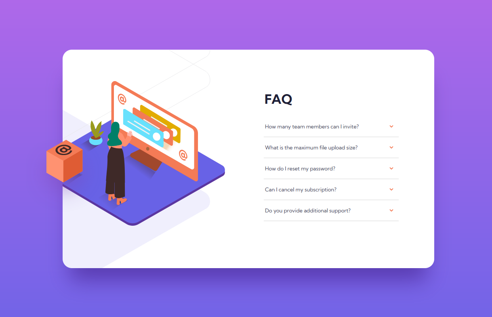

# FAQ accordion card

This is a solution to the [FAQ accordion card challenge on Frontend Mentor]

## Table of contents

- [Overview](#overview)
- [The challenge](#the-challenge)
- [Screenshot](#screenshot)
- [Links](#links)
- [Built with](#built-with)
- [Author](#author)

### The challenge

Users should be able to:

- View the optimal layout for the component depending on their device's screen size
- See hover states for all interactive elements on the page
- Hide/Show the answer to a question when the question is clicked

### Screenshot

### Links

- Live Site URL: (https://j-phillips-git.github.io/fem-faq-accordian-card/)

### Built with

- HTML
- CSS
- JavaScript

## Author

- LinkedIn - [https://www.linkedin.com/in/jordan-phillips-/]
- Frontend Mentor - [https://www.frontendmentor.io/profile/JordanPhillips-hub]